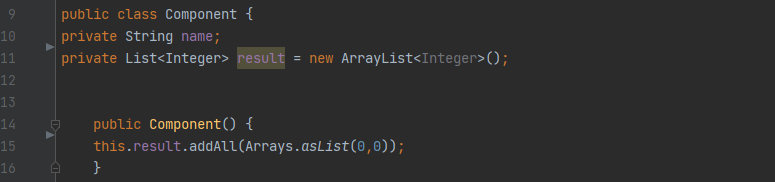
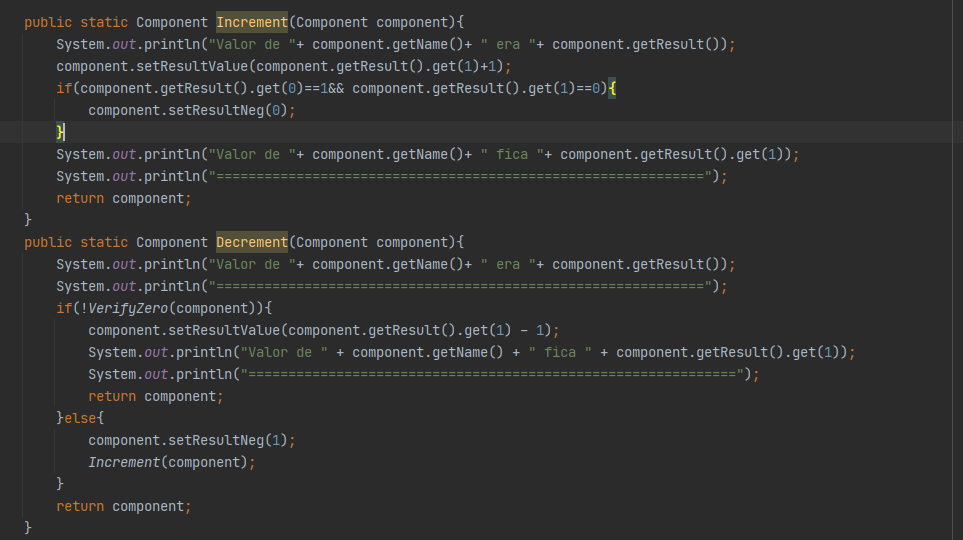
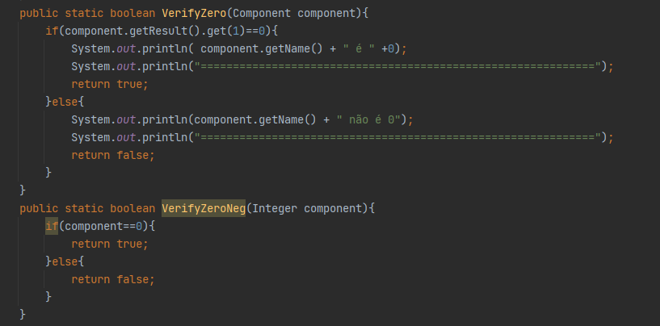
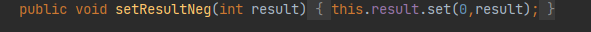
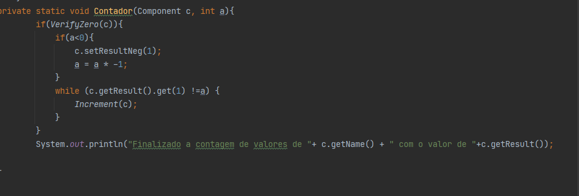
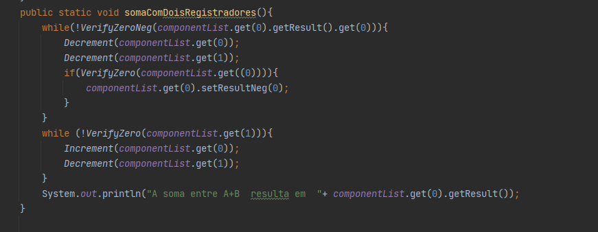
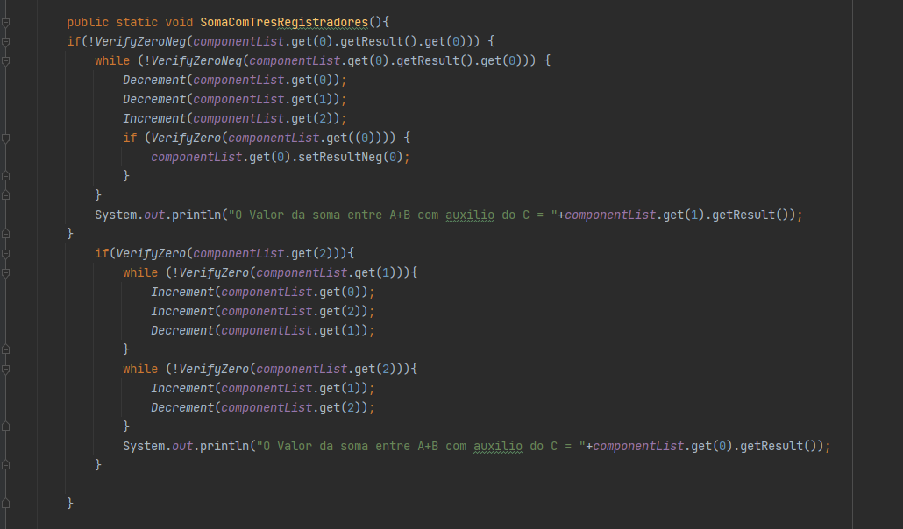
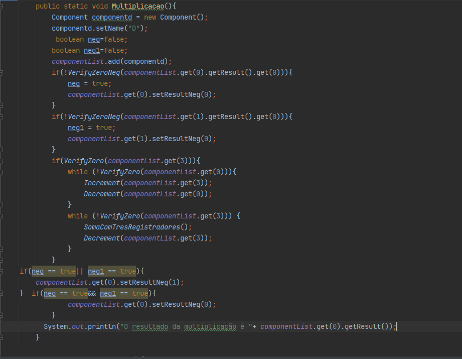
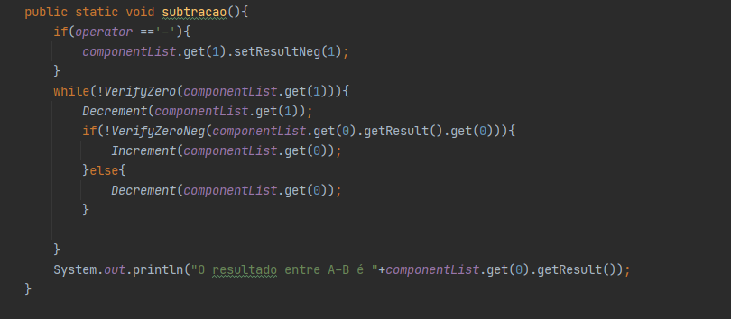

"# Maquina_Norma_Simulador" 
Sobre o codigo ele deseja pegar dois numeros e operator com macros.
Na Imagem abaixo tem o modelo utilizado para separar os Objetos. Cada vez criada um objeto novo ele e setado com o valor 0;

Na função abaixo demonstra como são feitos o incremento e decremento com as exeções caso o valor de negativo vire positivo e positivo ao negativo;

Próxima imagem se refere a verificar caso o valor seja 0, e negativo;
Exemplo de número positivo:[0,2] = 2;
Exemplo de número negativo:[1,2] = -2;

Se baseando no Incremento, Decremnto e no Verificar se é 0, setamos os valores  digitados no terminal nos objetos ;
Obs: caso digite o valor Negativo ja e transformado em positivo multiplicando por -1 e setando o negativo na primeira casa da lista;

Abaixo agora vaai passar as macros de dois tipos de soma, multiplicação e subtração;

As funções detalha passa tudo detalhado de como vai ser incrementando e decrementando como a maquina norma faria;
Obs:No caso da soma existe dois tipos de função que você possa testar para ver a diferença;

